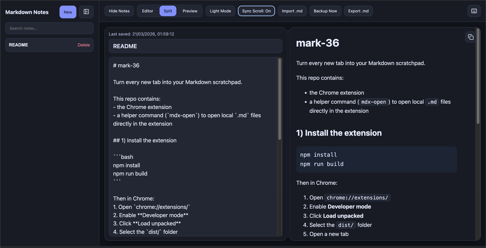

# mark-36

Turn every new tab into your Markdown scratchpad.

This repo contains:

- the Chrome extension
- a helper command (`mark-36`) to open local `.md` files directly in the extension

## 1) Install the extension

```bash
npm install
npm run build
```

Then in Chrome:

1. Open `chrome://extensions/`
2. Enable **Developer mode**
3. Click **Load unpacked**
4. Select the `dist/` folder
5. Open a new tab

## 2) Install and use the script (`mark-36`)

1. In extension details, enable **Allow access to file URLs**
2. Install the command:
  ```bash
   curl -sSL https://raw.githubusercontent.com/jatingarg36/mark-36/main/scripts/install-mark-36.sh | sudo sh
  ```
3. Use:
  ```bash
   mark-36 /absolute/path/to/file.md
  ```

## 3) Screenshot placeholders

### New tab workspace



## Contributing

Contributions are welcome.

1. Fork this repo
2. Create a feature branch
3. Make your changes
4. Open a pull request with a clear description

## License

MIT

